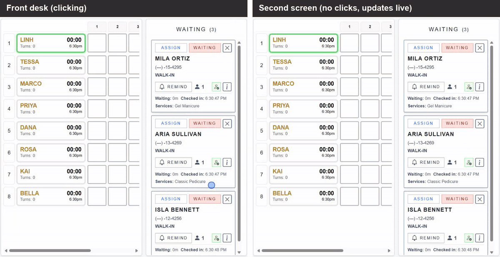
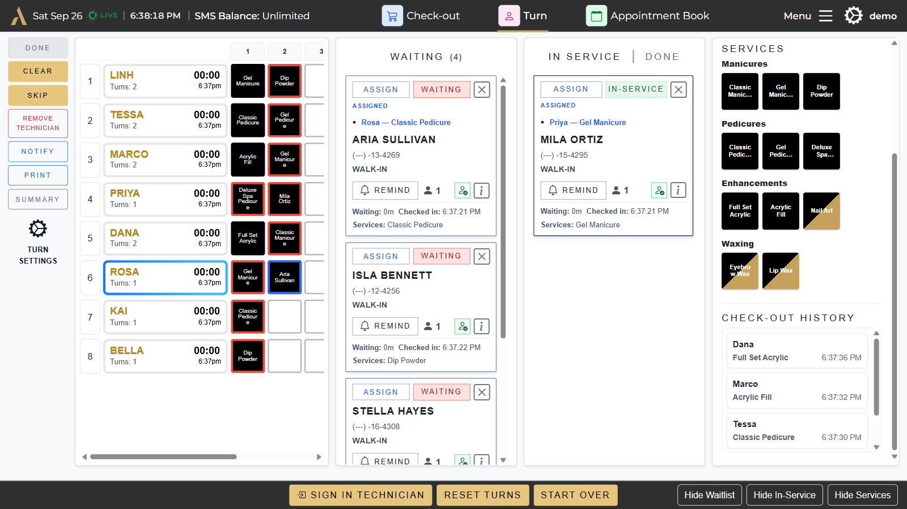
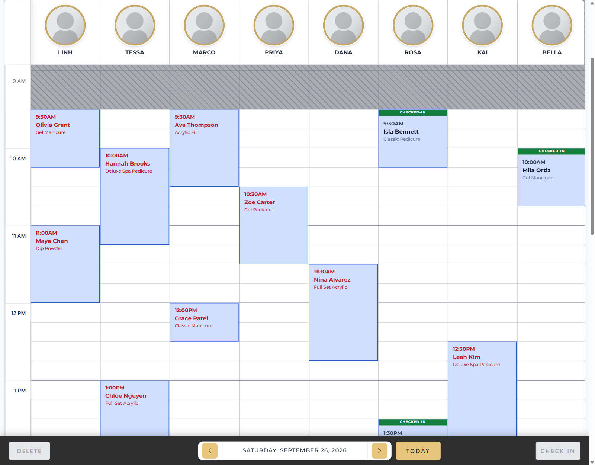
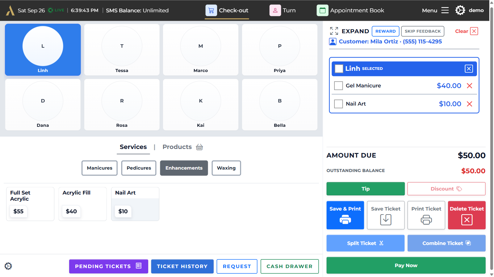
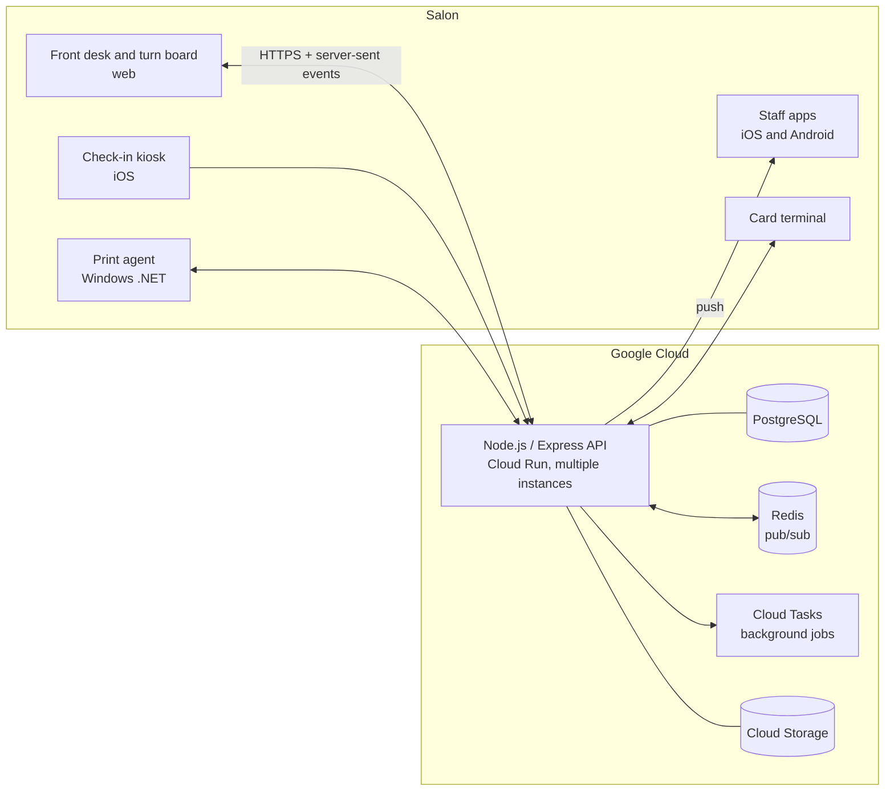

# AuraPOS

[](https://github.com/Aura-POS-LLC/AuraPOS-Showcase/actions/workflows/test.yml)

**Live at [aura-pos.com](https://aura-pos.com)**

**Point-of-sale and front-desk platform for nail salons.** Walk-in turn rotation, appointments, self check-in, checkout, commission payroll and loyalty, running in production across a web app, iOS and Android apps, and a Windows print agent.

> **About this repository.** The AuraPOS codebase is private. This repo is a showcase: a set of real modules extracted from production with their original tests, plus write-ups of how the larger system works. Clone it and run `npm test`. There are no dependencies to install.



*The front desk (left) assigns two walk-ins. A second screen (right) updates on its own. All names are demo data.*

## At a glance

| | |
|---|---|
| Built | November 2025 – present |
| Commits | 1,045, by a team of 4 |
| Tests | 293 test files in the production repo; 99 tests in this showcase |
| Clients | Web (front desk, turn board, checkout), iOS (SwiftUI), Android (Kotlin), Windows (.NET) |
| Languages | English and Vietnamese UI |

## The problem

Nail salons run on walk-ins. The front desk has to decide, all day and in real time, which technician takes the next client, and those decisions affect how technicians get paid. At the same time the desk is juggling booked appointments, checkout and card payments, and end-of-period commission payroll. Most salons do this with paper, a whiteboard and a generic POS that knows nothing about turns.

AuraPOS puts the whole day on one live system: every screen in the salon shows the same turn board, and a client's visit flows from check-in to turn assignment to checkout to payroll without being re-entered.

## A quick tour

### [Turn manager →](docs/turn-manager.md)

Who takes the next walk-in, shown live on every screen. Each technician's row fills with turns as the day goes, and walk-ins move from waiting to in service.



### [Appointment book →](docs/appointment-book.md)

The day by technician. Online bookings land here, and a block turns **Checked-in** when the client arrives at the kiosk.



### [Checkout →](docs/checkout.md)

Pick the technician and the client, build the ticket, then take payment. Tips, discounts, rewards and split tickets are all a tap away.



## What it does

| Area | Capabilities |
|---|---|
| **Turn manager** | Live board of technicians and their turns, walk-in queue, one-tap assignment, service timers, synced across every screen in the salon |
| **Appointments** | Appointment book, online booking with scheduling rules, technician time blocks, SMS confirmations |
| **Check-in** | Customer self check-in on an iPad kiosk (SwiftUI) |
| **Checkout** | Tickets, card terminal payments, discounts and reward credit, receipt printing |
| **Payroll** | Per-technician commission rates and fees, payroll reports and spreadsheet export |
| **Customers** | Visit history, loyalty points and rewards, review invites, SMS promotions with consent tracking |
| **Staff apps** | iOS and Android apps with push alerts for technicians and selectable alert sounds |
| **Security** | Passkey (WebAuthn) sign-in for owners, scoped admin access, rate limiting |

## Architecture



- **One API, many screens.** Every browser in the salon holds a live connection to the API over server-sent events. Writes go through the API and come back to every screen as versioned updates.
- **Multiple server instances.** Cloud Run can run several copies of the API. Changes made on one instance reach clients connected to another through a Redis event bus. Local development falls back to an in-memory bus.
- **The server decides.** Anything that could be edited from two screens at once (turn assignments, board state, tickets) is validated and versioned on the server. A stale write gets a conflict and a refresh instead of silently overwriting newer data.

## What's in this repo

Each package is real production code, copied with its original tests. Names and phone numbers in the test data have been replaced with fictional ones.

### [`packages/turn-manager`](packages/turn-manager) — the live turn board

The heart of the product and the hardest part to get right. It covers the board state model, the realtime streams that keep every screen in sync, and the logic that closes out a walk-in when their ticket is paid.

Things worth looking at:
- `board-stream.js` holds local edits in a save queue, drops a pending retry when an authoritative server update supersedes it, and runs a slow consistency poll that repairs a board that missed a realtime event.
- Every board write carries the calendar day it was loaded for, so a tablet left open overnight can't overwrite today's board with yesterday's.
- `queue-stream.js` asks for incremental queue updates using a version token and falls back to a full reload when needed.
- `queue-completion.js` works out which queued walk-ins a closed ticket covers and completes them.

### [`packages/checkout-sync`](packages/checkout-sync) — checkout across server instances

- `checkout-event-bus.js` wraps every checkout change in an envelope (event ID, origin instance, account, location, version) and publishes it through Redis. Instances skip their own echoes, and the version lets clients tell which update is newest.
- `checkout-tickets-singleflight.js` merges simultaneous "load today's tickets" requests for the same location into a single database read. It's a small fix for a real load spike when many screens refresh at once.

### [`packages/tickets`](packages/tickets) — ticket classification and technician summaries

- It decides whether each ticket line is a service or a retail product. That decides what counts toward a technician's service totals, and older tickets record it inconsistently.
- `tech-service-summary.js` is an optimized rewrite of a slow report. Its test runs the old and new versions side by side on randomly generated tickets and requires identical output.

### [`packages/payroll`](packages/payroll) — technician compensation

Commission rates and fees per technician. The tests cover the awkward real-world cases: a technician renamed mid-period, an older client app that saves without sending newer fields, and clearing a rate on purpose versus leaving it out by accident.

### [`packages/loyalty`](packages/loyalty) and [`packages/booking`](packages/booking)

Loyalty point and reward-credit rules, buffering for online booking requests, and phone-number matching that treats `+1 (555) 010-2030`, `555.010.2030` and `5550102030` as the same customer.

## Beyond this repo

These parts are described here but not published, because they touch payment credentials, customer data or signing keys:

- **Card terminal payments**, with recovery safeguards so a dropped connection mid-checkout doesn't lose a paid ticket.
- **Windows print agent** in .NET. It prints receipts in the salon and installs updates only after checking a signature against a key built into the app.
- **Passkey sign-in** (WebAuthn) for owners and admins on web and Android.
- **SMS billing**, a prepaid credit wallet for promotional texts, with consent tracking.
- **Local hub (in design)**, a small server inside each salon that keeps the front desk running through an internet outage and syncs with the cloud afterward.

## Running the tests

Requires Node.js 22 or newer. There's nothing to install.

```bash
git clone https://github.com/Aura-POS-LLC/AuraPOS-Showcase.git
cd AuraPOS-Showcase
npm test
```

## Repository layout

```
docs/             turn manager, appointment book and checkout, in depth
media/            screenshots and the demo GIF (demo data only)
packages/
  turn-manager/   live turn board engine, realtime streams, queue completion
  checkout-sync/  cross-instance event bus, single-flight ticket loading
  tickets/        line-item classification, technician service summaries
  payroll/        technician commission and roster settings
  loyalty/        points and reward credit
  booking/        booking request buffering, phone matching
```

## Tech stack

Node.js, Express, PostgreSQL, Redis, Google Cloud Run, Cloud Tasks, Cloud Storage, Firebase Cloud Messaging, Nunjucks, server-sent events, WebAuthn, SwiftUI, Kotlin, .NET, Playwright and the Node test runner.

## Team

AuraPOS was built by four developers who each worked across the whole product, from the backend and web app to the mobile clients.

- **Stephen Le** · [@Wheatlys](https://github.com/Wheatlys)
- **David Plam** · [@DPLCoding](https://github.com/DPLCoding)
- **Michelle Lisowski** · [@michelleLisowski](https://github.com/michelleLisowski)
- **Ken Tran** · [@kent0678](https://github.com/kent0678)

## License

Copyright © 2025–2026 the AuraPOS team. All rights reserved. This code is published for viewing only; no license to use, copy or distribute it is granted.
